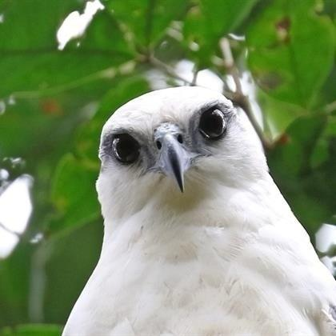

::: {.perfil-superior}

::: {.perfil-foto}

{fig-alt="Fotografía de perfil"}

:::

::: {.perfil-info}

# Daniela Blanco

## Estudiante de Bachillerato en Biología Tropical

Escuela de Ciencias Biológicas  
Universidad Nacional, Costa Rica

::: {.enlaces-perfil}

[<i class="bi bi-envelope-fill"></i> Correo](mailto:daniela.blanco.espinoza@est.una.ac.cr)

[<i class="bi bi-github"></i> GitHub](Linkedin: https://www.linkedin.com/in/daniela-blanco-78431b273)

[<i class="bi bi-person-badge-fill"></i> ORCID](https://orcid.org/0000-0003-2692-2022)

[<i class="bi bi-linkedin"></i> LinkedIn](Linkedin: https://www.linkedin.com/in/daniela-blanco-78431b273)

:::

:::

:::

---

## Biografía

Soy estudiante de bachillerato en Biología Tropical. Interesada en la ecología y conservación de la biodiversidad trópical, con especial atención a la fauna y flora silvestres. Me apasiona la ornitología en especial las aves rapaces, mastozología, en especial los felinos, entomología, los escarabajos y plantas en especial las araceae. Integrando a su vez herramientas como Sistemas de Información Geográfica (SIG), como el análisis espacialy el modelado de distribución de especies para comprender patrones ecológicos y apoyar estrategias de conservación de la vida silvestre.

Mi objetivo profesional es contribuir a la investigación científica y al desarrollo de soluciones que favorezcan la protección y el manejo sostenible de los ecosistemas tropicales. 

---

## Áreas de interés

- Ecología
- Conservación
- Biodiversidad
- Biogeografía
- Manejo de Vida Silvestre 
- Ciencia de datos
- Restauración Ecológica
- Monitoreo de Biodiversidad 
- Botánica

---

## Habilidades

- R
- Quarto (en entrenamiento)
- Git y GitHub
- Sistemas de Información Geográfica (SIG)
- Microsoft Office
- Investigación Científica
- Trabajo de Campo
- Muestreo Ecológico 
- Identificación de Fauna Tropical
- Visualización de Datos 
- Modelado de distribución de especies

---

## Formación académica

**Universidad Nacional (UNA)**

Bachillerato en Biología Tropical

*2021 – Presente*
