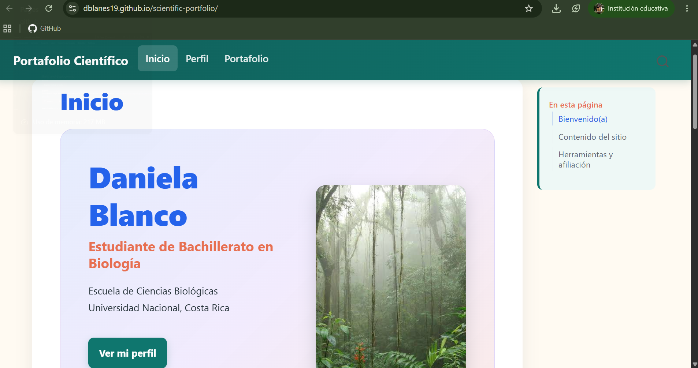

## Objetivo

Crear sitio web personalizado utilizando Quarto, RStudio y GitHub Pages.

## Materiales y herramientas

- RStudio
- Quarto
- Git
- GitHub

## Procedimiento

Explique de forma ordenada los pasos realizados durante la práctica.

## Resultados

Se realizó la creación exitosa del sitio web.

## Figuras y tablas

## Reflexión final

Responda brevemente:

- ¿Qué aprendí?
  - Este día aprendí sobre como actualizar y crear una página web desde el programa r.

<!-- -->

- ¿Qué dificultad encontré?
  - Crear la página web, puesto que mi profesor iba muy rápido.

<!-- -->

- ¿Cómo podría aplicar esta herramienta o conocimiento en otro contexto?
  - Crear páginas web para otras personas que deseen tener su propia página para su negocio en línea.
